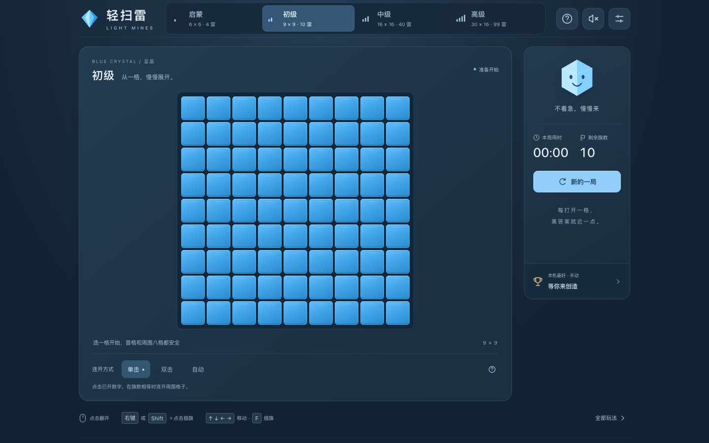

# 轻扫雷 · 蓝晶

面向家庭的中文网页扫雷：暗蓝舞台、蓝晶棋格、清楚的数字与旗帜，打开即可开始初级棋盘。交互方向参考 Microsoft Store 的 Microsoft Minesweeper；配色、素材和规则细节由本项目自行定义，不宣称逐像素复刻或微软官方出品。

项目使用 React、TypeScript、Vite 和 DOM 棋盘。没有账号、后端、数据库、广告、统计 SDK 或 LLM API。所有游戏规则在浏览器执行；刷新就是新局。



## 环境准备、编译与启动

使用 **Git、Node.js 24.x 和随 Node 提供的 npm**。当前工程核验环境为 Node.js **24.18.0**、npm **11.16.0**；`package.json` 固定 Node 主版本并锁定直接依赖，`package-lock.json` 固定依赖树。运行游戏不需要数据库、API key、环境变量、Docker 或 GPU；Playwright 浏览器只在运行端到端测试时需要安装。

### 获取源码与安装依赖

首次从 GitHub 获取项目：

```bash
git clone https://github.com/whyiug/minesweeper.git
cd minesweeper
node --version
npm --version
npm ci
```

如果已经在项目目录中，直接从 `node --version` 开始即可。使用 nvm 的机器可以先执行 `nvm install`、`nvm use`，它们读取仓库的 `.nvmrc` 并选择 Node 24；没有安装 nvm 时，使用自己的 Node 安装方式即可。`npm ci` 按 lockfile 安装依赖，首次安装需要能访问 npm 软件源。

### 开发启动

在项目根目录执行：

```bash
npm run dev
```

在**运行命令的那台电脑**上打开终端显示的地址，默认是 `http://127.0.0.1:5173`。修改源码后浏览器会自动更新。保持该终端运行，结束时按 `Ctrl+C` 停止本次服务。

开发服务器仅绑定本机。默认端口被占用时，Vite 会尝试其他端口，以终端输出为准；需要固定端口时使用：

```bash
npm run dev -- --port 5173 --strictPort
```

`--strictPort` 会在端口被占用时直接报错。可选择其他空闲端口，不要为此停止他人的服务。

### 编译正式产物

在已执行 `npm ci` 的项目目录中运行：

```bash
npm run build
```

该命令先检查 TypeScript 类型，再编译生成 `dist/`，其中包含 HTML、JS、CSS 和图标。编译完成后命令会退出，**不会启动网页服务**。`dist/` 是构建生成物，不提交到 Git；从 GitHub 克隆后需要自行构建，Vercel 也会按配置重新构建。

### 启动正式产物预览

构建成功后执行：

```bash
npm run preview
```

默认打开 `http://127.0.0.1:4173`，以终端实际输出为准。修改源码后，必须重新 `npm run build` 才会更新预览的产物。结束预览时按 `Ctrl+C`。

需要固定预览端口时执行 `npm run preview -- --port 4173 --strictPort`。端到端测试也使用 4173，因此不要同时运行同端口预览和 `npm run test:e2e`；可先停止自己的预览，或将预览改为其他端口。

`preview` 只用于本地核验，不是正式托管服务，也不代表已经发布到 Vercel。不要双击 `dist/index.html` 代替 HTTP 访问；正式静态部署见 [`docs/DEPLOYMENT.md`](docs/DEPLOYMENT.md)。

### 在远程服务器运行，从自己的电脑访问

如果命令是在远程服务器执行，自己电脑上的 `127.0.0.1` 不会自动指向服务器。保留服务的回环地址绑定，使用 SSH 端口转发访问即可，无需开放公网端口。

先在**服务器的项目目录**启动固定端口服务：

```bash
npm run dev -- --port 5173 --strictPort
```

然后在**自己电脑的另一个终端**运行，将 `your-user@your-server` 替换为日常 SSH 登录目标：

```bash
ssh -N -o ExitOnForwardFailure=yes -L 127.0.0.1:5173:127.0.0.1:5173 your-user@your-server
```

保持两个终端运行，在自己电脑的浏览器打开 `http://127.0.0.1:5173`。若自己电脑的 5173 已占用，可改为 `-L 127.0.0.1:15173:127.0.0.1:5173`，然后访问 `http://127.0.0.1:15173`。

预览正式产物时，服务器运行 `npm run build` 和 `npm run preview -- --port 4173 --strictPort`，SSH 转发命令中的两个 `5173` 都改为 `4173`，本机浏览器访问 `http://127.0.0.1:4173`。结束后分别在服务器服务终端和本机 SSH 转发终端按 `Ctrl+C`，只停止自己启动的进程。

### 常见启动问题

| 现象 | 处理方式 |
| --- | --- |
| Node 版本不符合要求或依赖安装报 engine 错误 | 切换到 Node 24.x，再执行 `npm ci` |
| 提示找不到 `vite` 或依赖包 | 确认当前目录含 `package.json`，先执行 `npm ci` |
| 预览提示没有 `dist` | 先执行 `npm run build`，再运行 `npm run preview` |
| 端口被占用 | 改用空闲端口，或停止自己启动的旧服务；同步调整浏览器地址与 SSH 转发端口 |
| 远程服务器已启动，但本机浏览器无法打开 | 检查 SSH 转发是否仍在运行、服务器服务端口与转发目标是否一致 |
| 修改源码后正式预览没有变化 | 重新执行 `npm run build`，再刷新预览页 |

## 怎么玩

数字表示八邻域中的地雷数量。翻开全部安全格即获胜，不要求插满旗。首次有效翻开会保护点击格及其邻格；首点保护不保证整局无猜。插旗只是玩家标记，系统不会确认是否正确。剩余旗数按“雷数减已插旗数”显示，可能为负。

| 难度 | 列 × 行 | 雷数 |
| --- | --- | --- |
| 启蒙 | 6 × 6 | 4 |
| 初级（默认） | 9 × 9 | 10 |
| 中级 | 16 × 16 | 40 |
| 高级 | 30 × 16 | 99 |

家长可在 [`src/config/game.ts`](src/config/game.ts) 把 `DEFAULT_DIFFICULTY` 改成 `intro` 后重新构建。

| 输入 | 翻开 | 插旗 / 取消旗 | 连开 |
| --- | --- | --- | --- |
| 鼠标 | 左键 | 右键或 Shift＋点击 | 按当前单击 / 双击 / 自动设置 |
| Mac 触控板 | 普通点按 | 系统辅助点按、Ctrl＋点击或 Shift＋点击 | 不要求双键同时按 |
| 触屏 | “翻开”模式点按 | “插旗”模式点按，或长按约 350 ms | 推荐单击或自动 |
| 键盘 | 方向键移动，Enter / 空格翻开 | F | 已开数字按一次 Enter / 空格，手动档均适用 |

Tab 进入棋盘一次，方向键在棋格间导航；Esc 关闭面板并返回原控件。触屏拖动棋盘可滚动，页面保留双指缩放。高级棋盘在窄屏需局部滚动，可选择“大格子”。

连开只有在已开非零数字的邻旗数量等于数字时才尝试打开其余邻格。单击为默认；双击只对事先已经打开的数字生效，隐藏格单击始终立即翻开。自动档在有效翻开或插旗改变后连续检查受影响数字。**插错旗也可能触雷**；自动连开不纠正旗子、不自动插旗、不使用求解器。

一个动作和随后的自动连开会先完整提交规则结果，动画只展示结果。快速点击和立即重开无需等待动画结束。改变难度或局中连开方式会明确提示开始新局；声音、动效、计时显示和格子大小不重开。

音效默认关闭，通过顶部按钮或设置主动开启。设置支持减少动效，同时遵循系统 `prefers-reduced-motion`。关闭计时显示仍会正常计时，切换标签页也继续累计时间。

## 本机榜和数据

获胜后选择“哥哥 / 弟弟 / 家长 / 访客”并主动保存，才会写入成绩。称呼只是标签，不是账号。每种难度的手动、自动榜分别保留耗时最短的 10 条；单击与双击归入手动榜，每局最多一条。

本机榜是唯一持久化内容，key 为 `light-mines:leaderboard:v2`。关闭本机榜后应用不访问其存储，已有记录保留，重新启用可继续查看；“清空本机榜”只删除本项目的 key。损坏数据和存储拒绝不会影响游戏。页面设置、棋局、随机种子、当前称呼及操作过程不会写入 `localStorage` 或 `sessionStorage`。

榜单不跨设备、浏览器或站点地址同步，也不保证永久保留；隐私浏览与清理站点数据可能使成绩丢失。它是家庭娱乐计时，不是防作弊竞赛服务。项目不主动上传成绩；静态托管平台仍处理网页请求，不能因此宣称网络链路完全无日志。

## 验证和文档

安装自动化浏览器后运行完整检查：

```bash
npx playwright install chromium firefox webkit
npm run check
```

浏览器下载和系统库需求取决于所在环境；安装失败或缺库应记录为受限，不能算测试通过。共享服务器优先使用现有依赖或自己的测试容器，避免改动他人的运行环境。

本次共享 Linux 主机缺少 WebKit 部分动态库和 Firefox 可用音频输出。按 [`docs/BROWSER_ENV.md`](docs/BROWSER_ENV.md) 准备项目本地库后，使用下面的完整命令复测：

```bash
LIGHT_MINES_WEBKIT_EXECUTABLE_PATH="$PWD/scripts/browser-env.sh" \
  bash scripts/with-test-audio.sh npm run check
```

`browser-env.sh` 是 WebKit 可执行入口；`with-test-audio.sh` 只在测试期间启动独立、带认证的 PulseAudio 虚拟输出，结束后清理自己的进程。它能验证真实浏览器的音频图和静音逻辑，不代表实际扬声器或听感已验证。正常桌面环境可直接使用 `npm run check`。

| 命令 | 作用 |
| --- | --- |
| `npm run typecheck` | TypeScript 类型检查 |
| `npm run lint` | ESLint 检查 |
| `npm run test:unit` | Vitest 规则、输入、存储、音效等单元 / 属性测试 |
| `npm run test:e2e` | Playwright 浏览器交互测试 |
| `npm run dev` | 启动开发服务，默认 `127.0.0.1:5173` |
| `npm run build` | 类型检查并生成静态 `dist/` |
| `npm run preview` | 预览已构建的 `dist/`，默认 `127.0.0.1:4173` |
| `npm run check` | 依次执行类型、lint、单测、构建和浏览器测试 |

实际执行结果和实现截图见 [`TEST_REPORT.md`](TEST_REPORT.md)。可重复的动效、音效和真机验收步骤见 [`docs/MANUAL_TESTS.md`](docs/MANUAL_TESTS.md)。截图用于检查视觉状态；音频模拟测试、静态截图、自动化 WebKit 都不能替代真实 Mac 触控板、Safari 和手机 / iPad 听感与触控验收。

静态部署步骤见 [`docs/DEPLOYMENT.md`](docs/DEPLOYMENT.md)。本次交付不执行线上发布，不修改远端账户或 Deployment Protection。素材说明见 [`ASSET_NOTICES.md`](ASSET_NOTICES.md)，完整产品合同见 [`plan.md`](plan.md)。

## 工程边界

`src/core/` 是纯规则层，注入时钟、随机源与局 ID，使用固定顺序队列完成自动连开事务。`src/input/` 统一指针和键盘动作；`src/presentation/` 消费已提交事件并去重、清理动效和声音；`src/storage/` 只处理榜单记录。显示层使用裁剪过的可见棋格，隐藏格的 DOM 名称不包含雷或邻雷数。前端代码可被开发者工具读取，因此不承诺隐藏真实棋盘能够防作弊。

V1 只包含蓝晶主题和随机标准扫雷。无猜题库、冒险模式、第二套主题、PWA、云榜和棋局恢复不属于本次交付范围。
